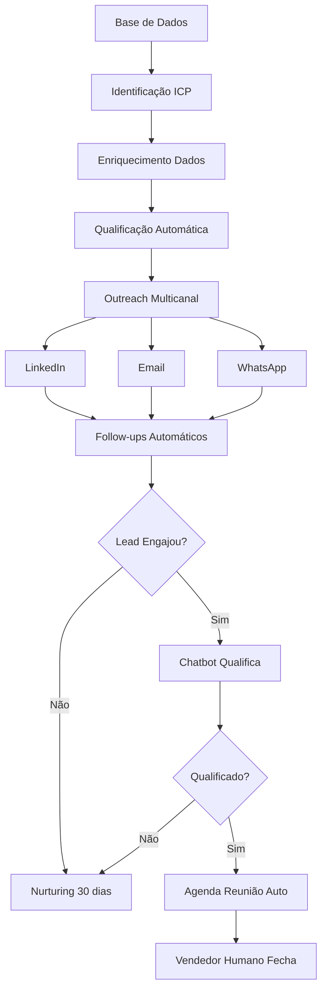

# 📖 Visão Geral - Automação de Vendas

← Voltar para [[🏠 HC Club - Central|Central]]

---

## O que é Automação de Vendas?

**Automação de Vendas** é o uso de tecnologia, software e inteligência artificial para **automatizar tarefas repetitivas** no processo comercial, permitindo que:

- 🤖 Sistemas trabalhem 24/7 sem intervenção humana
- 📈 Você escale prospecção sem contratar mais pessoas
- 💰 Reduza custo de aquisição de clientes (CAC)
- ⏰ Vendedores foquem em atividades de alto valor

---

## Por que Automatizar?

### Problema Tradicional

**Vendedor humano:**
- Trabalha 8h/dia
- Prospecta 20-30 leads/dia manualmente
- Esquece follow-ups
- Inconsistente
- Caro (salário + comissões + benefícios)

**Resultado:**
- 100-150 leads/mês
- 5-10 reuniões
- 1-2 fechamentos
- CAC alto

### Solução com Automação

**Sistema automatizado:**
- Trabalha 24/7
- Prospecta 500-1.000 leads/dia
- Follow-ups automáticos perfeitos
- 100% consistente
- Custo fixo baixo (R$ 800-2.000/mês)

**Resultado:**
- 10.000-20.000 leads/mês
- 100-200 reuniões
- 20-40 fechamentos
- CAC 5-10x menor

---

## Como Funciona na Prática

### Fluxo Completo Automatizado

**Detalhes:** [[Como-Funciona-Automacao|Veja como funciona em detalhes]]

---

## Componentes do Sistema

### 1. 🎯 Geração de Leads
**Ferramentas:** [[Apollo-io|Apollo.io]], [[Leads2b|Leads2b]], [[ZoomInfo|ZoomInfo]]

**O que faz:**
- Busca empresas que se encaixam no seu ICP
- Encontra contatos (emails, LinkedIn, telefones)
- Enriquece dados automaticamente

---

### 2. 📧 Outreach Automatizado
**Ferramentas:** [[Lemlist|Lemlist]], [[Smartlead|Smartlead]], [[Expandi|Expandi]]

**O que faz:**
- Envia sequências de emails/mensagens
- Personaliza em escala
- Follow-ups automáticos
- Testa variações (A/B test)

---

### 3. 🤖 Qualificação com IA
**Ferramentas:** [[Drift|Drift]], [[Weni|Weni]], [[ManyChat|ManyChat]]

**O que faz:**
- Conversa com leads 24/7
- Identifica dores e necessidades
- Qualifica usando BANT
- Agenda reuniões automaticamente

---

### 4. 📊 CRM e Tracking
**Ferramentas:** [[HubSpot|HubSpot]], [[Pipedrive|Pipedrive]], [[Agendor|Agendor]]

**O que faz:**
- Centraliza todas interações
- Scoreia leads automaticamente
- Dispara automações baseadas em comportamento
- Gera relatórios

---

## Tipos de Automação

### 🔵 Outbound (Proativo)
Você vai atrás do cliente

**Estratégias:**
- [[Estrategia-Cold-Email|Cold Email]]
- [[Estrategia-LinkedIn-Outbound|LinkedIn Outbound]]
- [[Estrategia-Multicanal|Multicanal]]

**Vantagens:**
- ✅ Resultados rápidos (7-30 dias)
- ✅ Controle total do processo
- ✅ Previsível

**Desafios:**
- ⚠️ Precisa de dados de qualidade
- ⚠️ Mensagens podem ser ignoradas
- ⚠️ Requer testes constantes

---

### 🟢 Inbound (Reativo)
Cliente vem até você

**Estratégias:**
- [[Estrategia-Content-Inbound|Content Marketing]]
- SEO
- Ads + Landing Pages
- Lead Magnets

**Vantagens:**
- ✅ Leads mais qualificados
- ✅ Custo por lead menor (longo prazo)
- ✅ Escalável

**Desafios:**
- ⚠️ Resultados demoram (3-6 meses)
- ⚠️ Precisa produzir conteúdo
- ⚠️ Competição alta

---

### 🟣 Híbrido (Recomendado)
Combina os dois

**Como funciona:**
1. Produz conteúdo no LinkedIn
2. Outbound para quem engajou
3. Retargeting para quem visitou site
4. Nurturing automático

**Resultado:** Melhor ROI

Veja: [[Estrategia-Multicanal|Estratégia Multicanal Completa]]

---

## Investimento Necessário

### 💰 Starter (R$ 800/mês)
**Ferramentas:** Apollo + Lemlist + Sales Navigator
**Para:** Startups, freelancers, pequenos negócios
**Resultado esperado:** 10-15 reuniões/mês

### 💰 Growth (R$ 1.800/mês)
**Ferramentas:** Leads2b + Lemlist + Expandi + HubSpot
**Para:** PMEs, agências, consultorias
**Resultado esperado:** 30-50 reuniões/mês

### 💰 Scale (R$ 16.000/mês)
**Ferramentas:** ZoomInfo + La Growth Machine + Drift + HubSpot Pro
**Para:** Empresas estabelecidas, scale-ups
**Resultado esperado:** 100-200 reuniões/mês

**Análise completa:** [[ROI-Automacao-Vendas|ROI e Investimentos]]

---

## ROI Esperado

### Cenário Real: PME

**Investimento:** R$ 2.000/mês (ferramentas)
**Prospecção:** 1.000 leads/mês
**Reuniões:** 30/mês (3% conversão)
**Fechamentos:** 6/mês (20%)
**Ticket médio:** R$ 5.000

**Receita:** R$ 30.000/mês
**ROI:** 1.400%

**Mais cenários:** [[ROI-Automacao-Vendas|Ver análises completas]]

---

## Quando NÃO Automatizar

⛔ **Evite automação se:**

- Ticket médio muito alto (>R$ 100k)
- Processo de venda muito complexo (6+ stakeholders)
- Nicho extremamente pequeno (<1.000 empresas)
- Produto precisa de demonstração pessoal sempre

Nesses casos, use automação apenas para **parte** do processo (ex: prospecção e agendamento, mas venda 100% humana).

---

## Métricas de Sucesso

### 📊 Principais KPIs

**Topo do Funil:**
- Leads prospectados/mês
- Taxa de entrega (deliverability)
- Open rate: 40-60%
- Reply rate: 5-15%

**Meio do Funil:**
- Reuniões agendadas
- Taxa de comparecimento: 60-80%
- Leads qualificados (SQL)

**Fundo do Funil:**
- Propostas enviadas
- Taxa de fechamento: 15-25%
- CAC (Custo de Aquisição)
- LTV:CAC ratio: 3:1+

**Guia completo:** [[Metricas-KPIs|Métricas e KPIs]]

---

## Próximos Passos

### 1️⃣ Entender o Sistema
- ✅ Você está aqui!
- [ ] Ler: [[Como-Funciona-Automacao|Como Funciona na Prática]]
- [ ] Ler: [[ROI-Automacao-Vendas|Análise de ROI]]

### 2️⃣ Escolher Ferramentas
- [ ] Ver: [[Comparativo-Ferramentas|Comparativo de Ferramentas]]
- [ ] Definir budget
- [ ] Escolher stack

### 3️⃣ Planejar Implementação
- [ ] Ler: [[Guia-Implementacao-Rapida|Guia de 30 Dias]]
- [ ] Definir: [[Definir-ICP|Seu ICP]]
- [ ] Seguir: [[Roadmap-4-Fases|Roadmap Completo]]

### 4️⃣ Executar
- [ ] [[Setup-Tecnico|Setup Técnico]]
- [ ] [[Checklist-Primeira-Campanha|Primeira Campanha]]
- [ ] Monitorar e otimizar

---

## Recursos Relacionados

### 📚 Leia Também
- [[Estrategia-Multicanal|Estratégia Multicanal (a melhor)]]
- [[Templates-Cold-Email|Templates Prontos]]
- [[Casos-de-Sucesso|Casos de Sucesso Reais]]
- [[Compliance-LGPD|Compliance e LGPD]]

### 🛠️ Ferramentas
- [[Ferramentas-Prospeccao|Prospecção]]
- [[Ferramentas-Email|Email Automation]]
- [[Ferramentas-LinkedIn|LinkedIn Automation]]
- [[Ferramentas-Chatbot|Chatbots e IA]]

### 🎯 Estratégias
- [[Estrategia-Cold-Email|Cold Email]]
- [[Estrategia-LinkedIn-Outbound|LinkedIn Outbound]]
- [[Estrategia-Chatbot-Qualification|Chatbot Qualification]]

---

## ❓ Perguntas Frequentes

**Q: Quanto tempo leva para ver resultados?**
A: Outbound: 7-30 dias. Inbound: 3-6 meses.

**Q: Preciso saber programar?**
A: Não! Todas as ferramentas são no-code/low-code.

**Q: E se não funcionar?**
A: Automação sempre funciona se bem executada. O segredo está em: ICP bem definido + mensagens de valor + persistência.

**Q: Posso automatizar 100%?**
A: Não recomendado. Ideal: 80% automático, 20% humano.

**Q: É legal? LGPD?**
A: Sim, se feito corretamente. Veja: [[Compliance-LGPD|Guia de Compliance]]

---

← Voltar para [[🏠 HC Club - Central|Central]]

**Tags:** #automacao #vendas #visao-geral #conceitos #roi

**Última atualização:** 12/11/2025